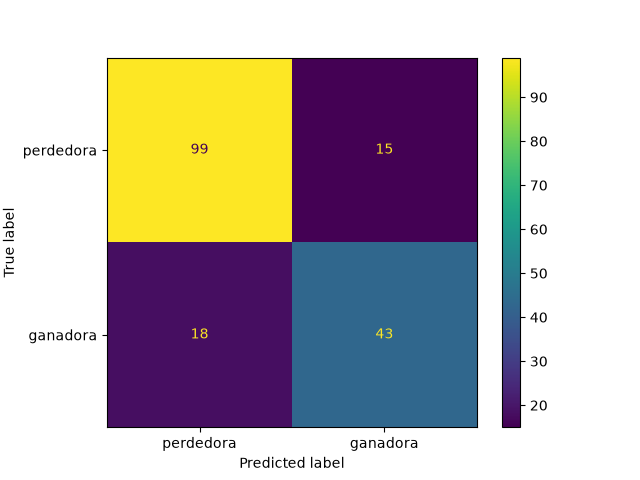
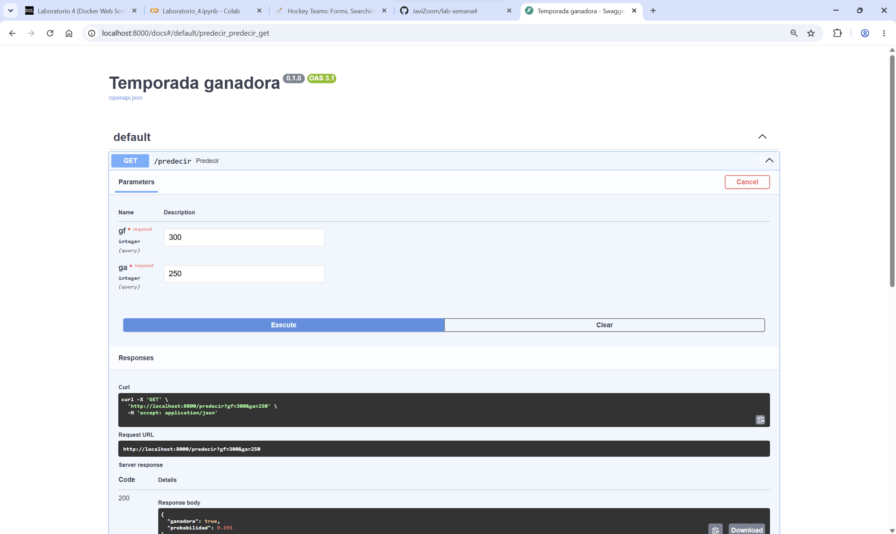
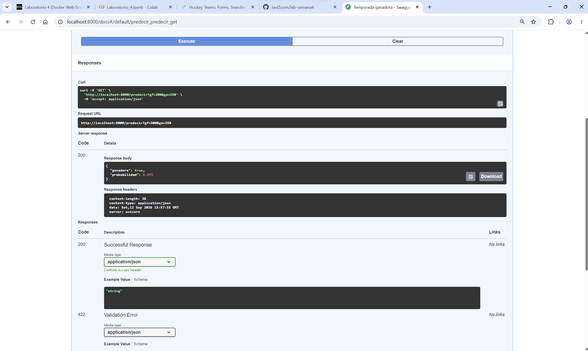
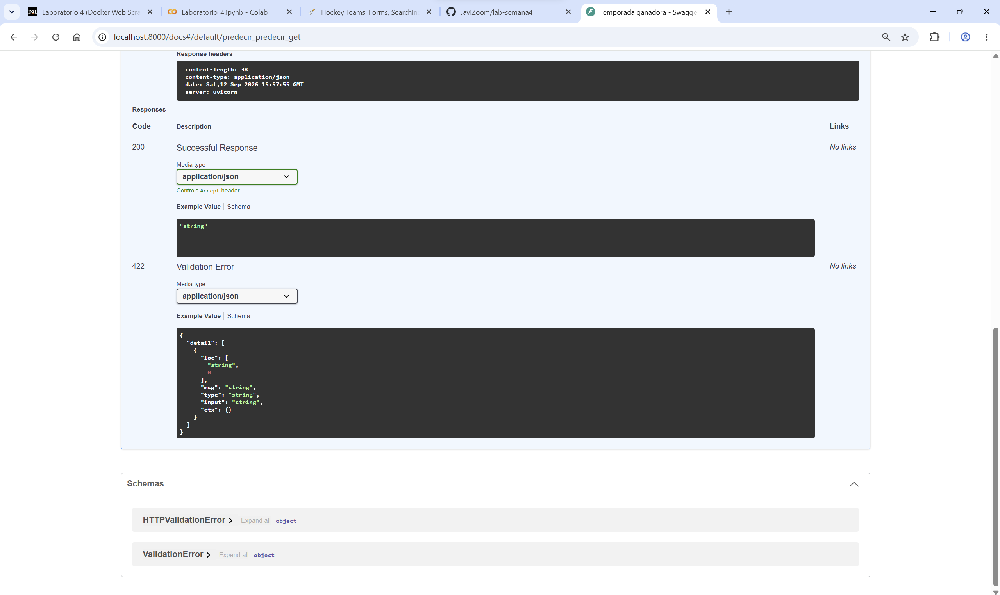
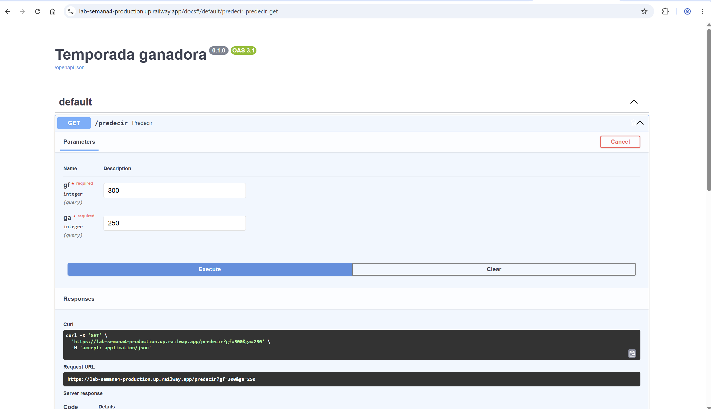
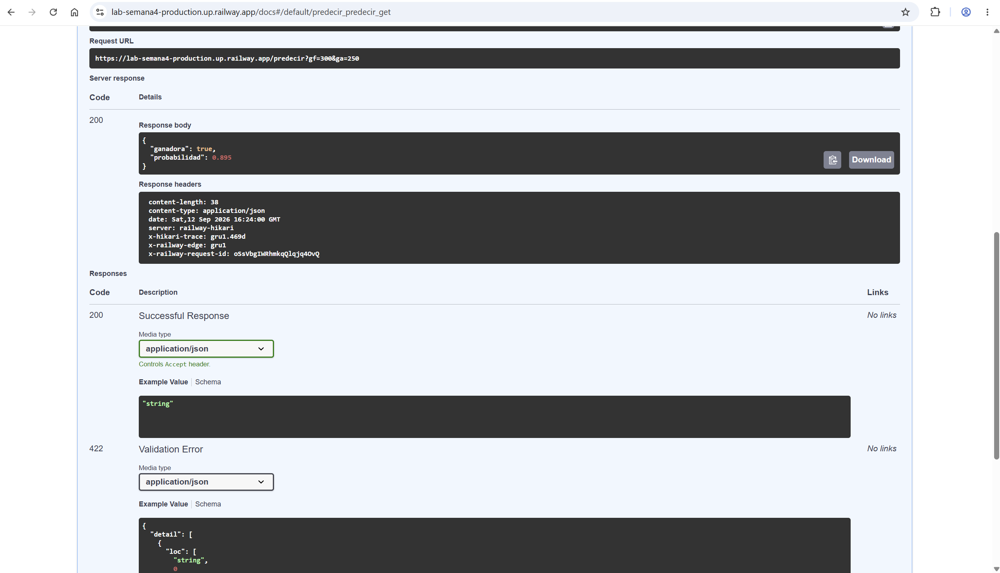
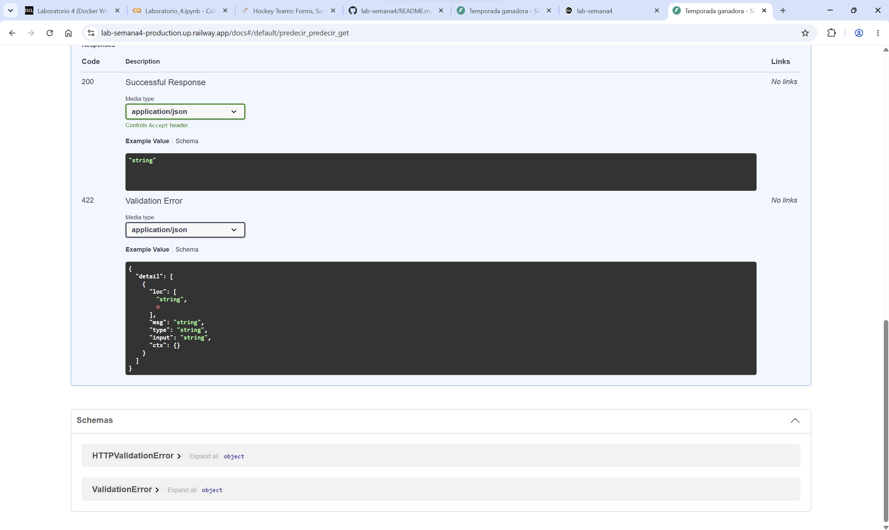

# Lab semana 4 — De la web a una API

Predicción de si una temporada de un equipo de la NHL fue "ganadora" (win_pct > 0.5)
a partir de gf (goles a favor), ga (goles en contra) y dif (diferencia de goles).
Datos bajados de [scrapethissite.com/pages/forms](https://www.scrapethissite.com/pages/forms/?page_num=1&per_page=100)
(582 filas, 6 páginas de 100 equipos).

Todo el flujo (scraping → dataset → modelo → API) está en [pipeline.py](pipeline.py),
se ejecuta con:

powershell
uv run python pipeline.py

Ese script deja escritos equipos.csv, equipos.parquet, modelos/modelo.joblib,
servir.py y Dockerfile, listos para construir la imagen de Docker.

## 1 · CSV vs Parquet — tamaños

csv        28.4 KB
parquet    12.8 KB

**Anota los dos tamaños. ¿Te sorprende cuál gana?**

Gana Parquet, y con bastante margen (menos de la mitad del peso del CSV). No me
sorprende: Parquet es un formato binario columnar, guarda cada columna con su
tipo de dato ya definido (enteros, floats) en vez de repetir todo como texto
plano separado por comas, y además comprime. El CSV en cambio escribe cada
número como caracteres ("300", "0.67"...), así que gasta más bytes por el
simple hecho de ser texto legible por humanos.

## 2 · Balance de clases

ganadora
False    0.65
True     0.35

diferencia media de goles en cada grupo:
ganadora
False   -21.3
True     40.2

El 65 % de las temporadas no son ganadoras y el 35 % sí: las clases están
desbalanceadas. La buena noticia es que dif sí separa bien los dos grupos
(en promedio -21 goles contra +40), lo que anticipa que el modelo real va a
poder aprender algo útil con esta variable.

## 3 · Modelo tonto vs. modelo real

| Modelo       | Exactitud | F1 (clase True) |
|--------------|-----------|--------------------|
| Tonto (baseline) | 0.651 | 0.000 |
| Regresión logística (el mío) | 0.811 | 0.723 |

**Compara la exactitud y el F1 de los dos modelos. ¿Qué hace mal el modelo
tonto que mirar únicamente la exactitud podría ocultar?**

Si solo mirara la exactitud, el modelo tonto parecería razonable: acierta el
65 % de las veces sin hacer ningún esfuerzo, y mi modelo "solo" sube a 81 %,
una mejora que a simple vista no parece enorme. El problema es que el tonto
consigue ese 65 % **repitiendo siempre False**: nunca predice una sola
temporada ganadora. Su recall para la clase True es 0 (no encuentra
ninguna) y por lo tanto su F1 también es 0. La exactitud alta lo esconde
porque hay muchas más temporadas perdedoras que ganadoras (65/35), así que
"decir siempre no" ya acierta la mayoría por pura suerte del desbalance. Mi
modelo, en cambio, sí detecta el 70 % de las temporadas ganadoras reales
(recall 0.70) con una precisión de 0.74, lo que da un F1 de 0.723 — la
diferencia real de que el modelo aprendió algo, en vez de solo repetir la
clase mayoritaria.

### Matriz de confusión (mi modelo, sobre las 175 filas de prueba)

|                  | Predicho: perdedora | Predicho: ganadora |
|------------------|----------------------|----------------------|
| **Real: perdedora** | 99 (verdadero negativo) | 15 (falso positivo) |
| **Real: ganadora**  | 18 (falso negativo)     | 43 (verdadero positivo) |

De las 61 temporadas que de verdad fueron ganadoras, el modelo encontró 43 y
se le escaparon 18 (esos 18 son el costo de tener recall 0.70). De las 114
que de verdad fueron perdedoras, acertó 99 y se equivocó en 15, diciendo
"ganadora" cuando no lo era (esos 15 explican la precisión 0.74: de las
43+15=58 veces que predijo "ganadora", solo 43 eran correctas). Los dos
tipos de error están bastante balanceados (15 falsos positivos vs. 18 falsos
negativos), no hay un sesgo fuerte hacia inventar ganadoras ni hacia
ignorarlas — el modelo simplemente tiene un margen de error parecido en
ambas direcciones, coherente con que `gf`, `ga` y `dif` explican bastante
pero no toda la historia de una temporada (factores como lesiones, calendario
o rachas no están en estos datos).

## 4 · Por qué se guarda el Pipeline completo y no solo la regresión logística

StandardScaler calculó, con los datos de entrenamiento, la media y la
desviación estándar de gf, ga y dif, y LogisticRegression aprendió sus
coeficientes **asumiendo que las entradas ya vienen escaladas con esos mismos
números**. Si guardara solo el clasificador y no el pipeline entero, la API
recibiría los goles en su escala original (números tipo 300, 250) en lugar de
los valores escalados (tipo -0.2, 1.3) con los que el modelo fue entrenado.
El clasificador no lanzaría ningún error porque técnicamente sigue recibiendo
tres números, pero las predicciones serían incorrectas sin ningún aviso, ya
que la regresión logística interpretaría esas escalas distintas como si
fueran patrones reales. Guardar el Pipeline completo garantiza que
cualquier dato nuevo pase por **exactamente** las mismas dos etapas
(escalado + clasificación) que se usaron en el entrenamiento.

## 5 · Docker sin -v

Corrí el contenedor sin el flag -v (sin montar la carpeta modelos/ local)
y el contenedor se cae inmediatamente al arrancar: no llega a exponer el
puerto 8000 y termina (docker ps ya no lo lista). La causa es que la imagen
de Docker solo copia servir.py (ver Dockerfile), nunca el archivo
modelos/modelo.joblib — ese archivo vive fuera de la imagen, en mi
computadora. Sin el -v "$PWD/modelos:/app/modelos", dentro del contenedor
la carpeta modelos/ no existe, así que la línea joblib.load("modelos/modelo.joblib")
lanza un FileNotFoundError al importar servir.py, lo que hace fallar el
arranque de uvicorn y el contenedor se cierra solo. El -v es justamente
lo que conecta el modelo entrenado (que vive en mi disco) con el código que
corre aislado dentro del contenedor.

## Captura de la API

GET /predecir?gf=300&ga=250 responde 200 OK:

json
{
  "ganadora": true,
  "probabilidad": 0.895
}

Parámetros enviados (gf=300, ga=250) y el curl que genera Swagger:

Respuesta del servidor (código 200, cuerpo y headers):

Esquemas de respuesta documentados por FastAPI (200 y 422):

## Cómo reproducir

powershell
uv sync
uv run python pipeline.py
docker build -t nhl-api .
docker run -p 8000:8000 -v "${PWD}/modelos:/app/modelos" nhl-api
# abrir http://localhost:8000/docs

## 7 · Del localhost a Internet (opcional)

Para que la API deje de vivir solo en mi computadora, cambié la estrategia de
cómo el contenedor consigue el modelo:

- **En local** usaba -v para montar mi carpeta modelos/ dentro del
  contenedor. Eso funciona en mi máquina, pero Railway no tiene esa carpeta
  para montar.
- Por eso el Dockerfile ahora copia el modelo dentro de la imagen con
  COPY modelos ./modelos, así el .joblib viaja empaquetado junto con el
  código y ya no depende de -v.
- También cambié el CMD para leer el puerto desde la variable de entorno
  PORT (con 8000 como valor por defecto): en mi computadora esa variable no
  existe y sigue usando 8000, pero en Railway es la plataforma quien decide
  el puerto y lo pasa por ahí.

Con eso el mismo Dockerfile sirve para correr en mi máquina y para
desplegarse en la nube sin tocar nada más.

**URL pública:** https://lab-semana4-production.up.railway.app/docs

Prueba real de GET /predecir?gf=300&ga=250 sobre esa URL, respondiendo 200 OK:

json
{
  "ganadora": true,
  "probabilidad": 0.895
}

Parámetros enviados desde /docs en Railway:

Respuesta del servidor (código 200, cuerpo y headers, servido desde railway-hikari):

Esquemas de respuesta documentados por FastAPI en producción:

